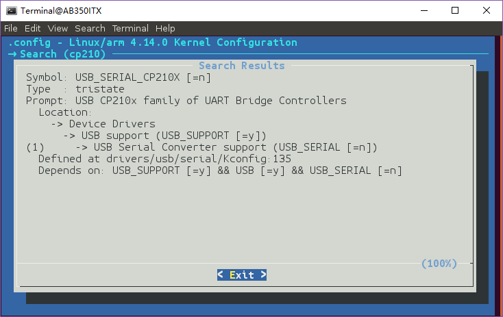
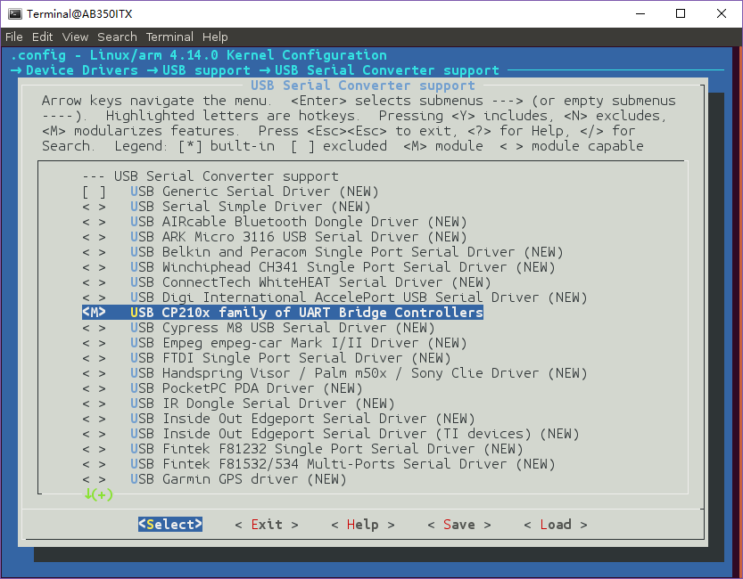

# 如何使用Petalinux编译ko文件

.ko文件是kernel object文件(内核模块)，该文件的意义就是把内核的一些功能移动到内核外边，需要的时候插入内核，不需要时卸载。

## 传统方式编译ko文件
编译ko时需要linux的内核源码，以下面最简单的驱动为例，介绍通用的编译内核驱动的方法:
### 编写hello.c文件
```sh
#include <linux/init.h>
#include <linux/module.h>
MODULE_LICENSE("Dual BSD/GPL");

static int hello_init(void)
{
  printk(KERN_ERR"Hello，world.\n");
  return 0x0;
}

static void hello_exit(void)
{
  printk(KERN_ERR"Hello，exit.\n");
  return;
}

module_init(hello_init);
module_exit(hello_exit);
```
### 编写Makefile
```sh
obj-m += hello.o
CURRENT_PATH := $(shell pwd)
LINUX_KERNEL := $(shell uname -r)
LINUX_KERNEL_PATH := {PATH to Linux Source}/linux-headers-$(LINUX_KERNEL)
all:
  make -C $(LINUX_KERNEL_PATH) M=$(CURRENT_PATH) moduels
clean:
  make -C $(LINUX_KERNEL_PATH) M=$(CURRENT_PATH) clean
```

### 编译ko文件 
```sh 
$ make 
```
## 使用Petalinux编译ko文件
上面的流程比较繁琐，既要下载linux源代码，又要编写makefile，使用Petalinux，我们可以非常方便地编译ko文件。使用Petalinux既可以将内核源码中的部分驱动以module模式编译，也可以用来编译用户自己的驱动程序。下面以为PYNQ-Z2板卡编译cp210x和PWM驱动为例，介绍两种编译模式。

### 以module模式编译内核源码
```sh
$ petalinux-create --type project --template zynq --name PYNQ //新建一个petalinux工程
$ cd PYNQ/
$ petalinux-config --get-hw-description <path to hdf> //导入hdf文件
$ petalinux-config -c kernel //配置内核
```
此时会弹出一个图形界面方便用户配置内核，由于内容过多，我们可以先搜索要编译的cp210x的位置。按下'/'键进入搜索界面，输入cp210x此处还可以看到cp210x的依赖。


Device Drivers->USB support->USB Serial Converter support配置为module模式如下图所示


然后进入该选项，勾选USB CP210x family of UART Bridge Controllers配置为module模式如下图所示


保存后退出。
我们在project-spec/meta-user/recipes-kernel/linux/linux-xlnx/user_xxx.cfg中看到
```sh
CONFIG_USB_SERIAL=m
# CONFIG_USB_SERIAL_GENERIC is not set
# CONFIG_USB_SERIAL_SIMPLE is not set
# CONFIG_USB_SERIAL_AIRCABLE is not set
# CONFIG_USB_SERIAL_ARK3116 is not set
# CONFIG_USB_SERIAL_BELKIN is not set
# CONFIG_USB_SERIAL_CH341 is not set
# CONFIG_USB_SERIAL_WHITEHEAT is not set
# CONFIG_USB_SERIAL_DIGI_ACCELEPORT is not set
CONFIG_USB_SERIAL_CP210X=m
# CONFIG_USB_SERIAL_CYPRESS_M8 is not set
# CONFIG_USB_SERIAL_EMPEG is not set
# CONFIG_USB_SERIAL_FTDI_SIO is not set
# CONFIG_USB_SERIAL_VISOR is not set
# CONFIG_USB_SERIAL_IPAQ is not set
# CONFIG_USB_SERIAL_IR is not set
# CONFIG_USB_SERIAL_EDGEPORT is not set
# CONFIG_USB_SERIAL_EDGEPORT_TI is not set
# CONFIG_USB_SERIAL_F81232 is not set
# CONFIG_USB_SERIAL_F8153X is not set
# CONFIG_USB_SERIAL_GARMIN is not set
# CONFIG_USB_SERIAL_IPW is not set
# CONFIG_USB_SERIAL_IUU is not set
# CONFIG_USB_SERIAL_KEYSPAN_PDA is not set
# CONFIG_USB_SERIAL_KEYSPAN is not set
# CONFIG_USB_SERIAL_KLSI is not set
# CONFIG_USB_SERIAL_KOBIL_SCT is not set
# CONFIG_USB_SERIAL_MCT_U232 is not set
# CONFIG_USB_SERIAL_METRO is not set
# CONFIG_USB_SERIAL_MOS7720 is not set
# CONFIG_USB_SERIAL_MOS7840 is not set
# CONFIG_USB_SERIAL_MXUPORT is not set
# CONFIG_USB_SERIAL_NAVMAN is not set
# CONFIG_USB_SERIAL_PL2303 is not set
# CONFIG_USB_SERIAL_OTI6858 is not set
# CONFIG_USB_SERIAL_QCAUX is not set
# CONFIG_USB_SERIAL_QUALCOMM is not set
# CONFIG_USB_SERIAL_SPCP8X5 is not set
# CONFIG_USB_SERIAL_SAFE is not set
# CONFIG_USB_SERIAL_SIERRAWIRELESS is not set
# CONFIG_USB_SERIAL_SYMBOL is not set
# CONFIG_USB_SERIAL_TI is not set
# CONFIG_USB_SERIAL_CYBERJACK is not set
# CONFIG_USB_SERIAL_XIRCOM is not set
# CONFIG_USB_SERIAL_OPTION is not set
# CONFIG_USB_SERIAL_OMNINET is not set
# CONFIG_USB_SERIAL_OPTICON is not set
# CONFIG_USB_SERIAL_XSENS_MT is not set
# CONFIG_USB_SERIAL_WISHBONE is not set
# CONFIG_USB_SERIAL_SSU100 is not set
# CONFIG_USB_SERIAL_QT2 is not set
# CONFIG_USB_SERIAL_UPD78F0730 is not set
# CONFIG_USB_SERIAL_DEBUG is not set
```
然后编译工程
```sh
$ petalinux-build
```
编译结束后我们可以通过find指令找到ko文件
```sh
$ find . -name cp210.ko
```
### 编译用户自己的ko文件
 ```sh
$ petalinux-create -t modules -n pwm
$ vim project-spec/meta-user/recipes-modules/pwm/files/pwm.c //将pwm.c的内容替换成自己的，可以参照jiangwx/zynqbook/pwm.c
$ petalinux-create -c rootfs //检查一下modules项有没有勾选pwm，如果没有勾选就选上
 ```

然后编译工程
```sh
$ petalinux-build
```
同样，编译结束后我们可以通过find指令找到pwm.ko文件
```sh
$ find . -name pwm.ko
